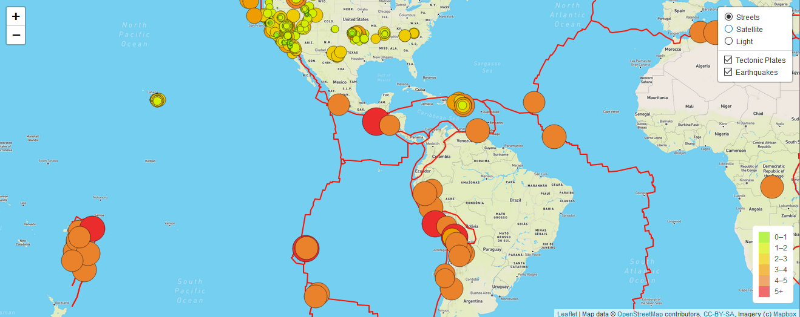

# Mapping_Earthquakes

In this repository I demonstrate how we can easily build a webpage consisting of map and related tools using public available resource and technology.  

Here are some of the technology used:
- Javascript
- Mapbox API
- Leaflet js library
- HTML & CSS

I was able to build various maps using common practices and technology.  The Earthquake_Challenge Folder contain 3 styles of basemap tiles that can be selected by the user.  On top of the base tile, I layered additional data where the earthquakes are for the last 7 days.  As well as the known tectonic plate data.  Both of which can also be toggled by the user against any of the 3 base maps.  The data sources are pulled live in real time from USGS earthquake data and the tectonic plate data pulled from another user's public Github repo.  
